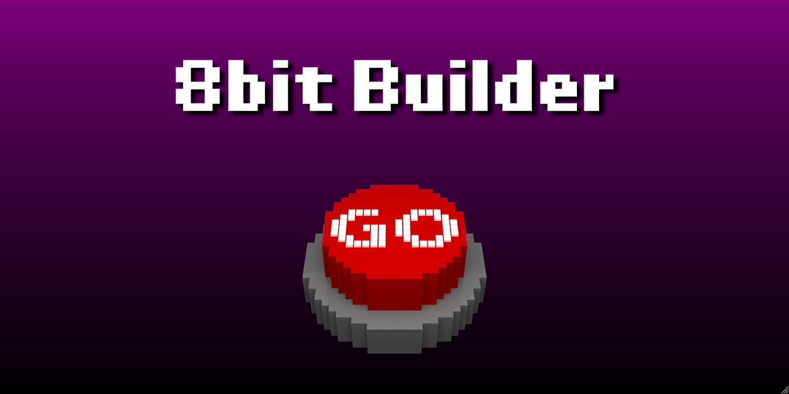

# 8bit-Builder

> Press the button where magic happens.

This is a random generator of [8bit music](https://en.wikipedia.org/wiki/Chiptune). The project is based on [Tone.js](https://tonejs.github.io/), a framework for creating interactive music in the browser.

## Contributors
**Navi Ning**

: Chief Designer

**Nacuang Wang**
: Developer

**Dalao Kong**: Designer
